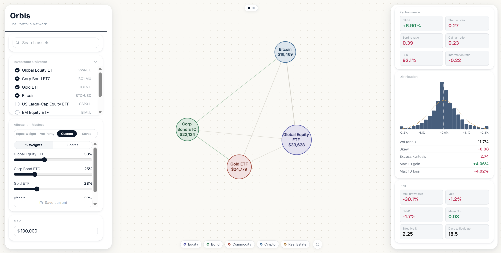
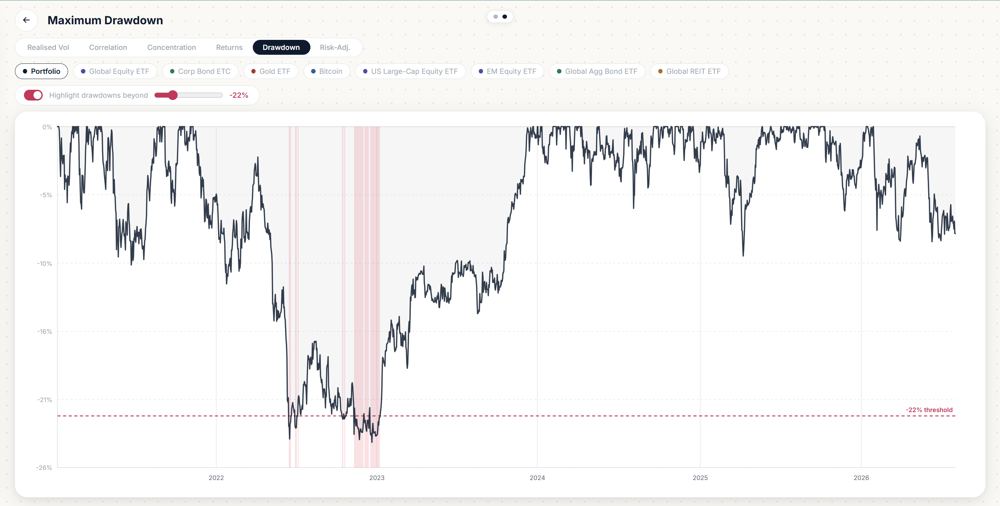

# orbis
Orbis is a portfolio visualisation tool designed to help understand the relationship between assets within in investment portfolio beyond typical correlations. It features a selectable investable universe, set and custom allocation methods as well as performance, distributional and risk measures. Time-series analyis of volatility, drawdowns, correlation, and risk-adjusted measures can also be viewed in chart tab.

  

  <em>Orbis graph view preview</em>

  

  <em>Orbis chart view preview</em>

